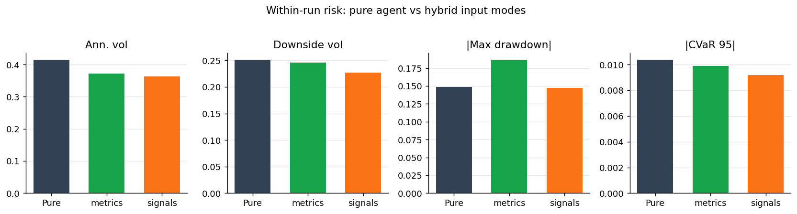
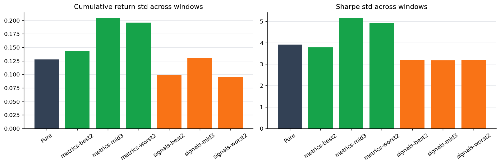
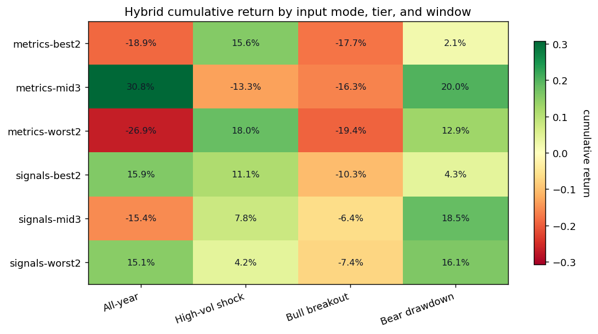
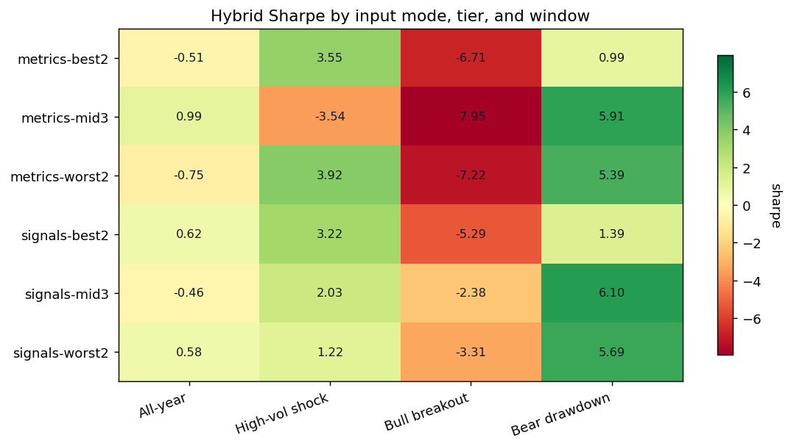
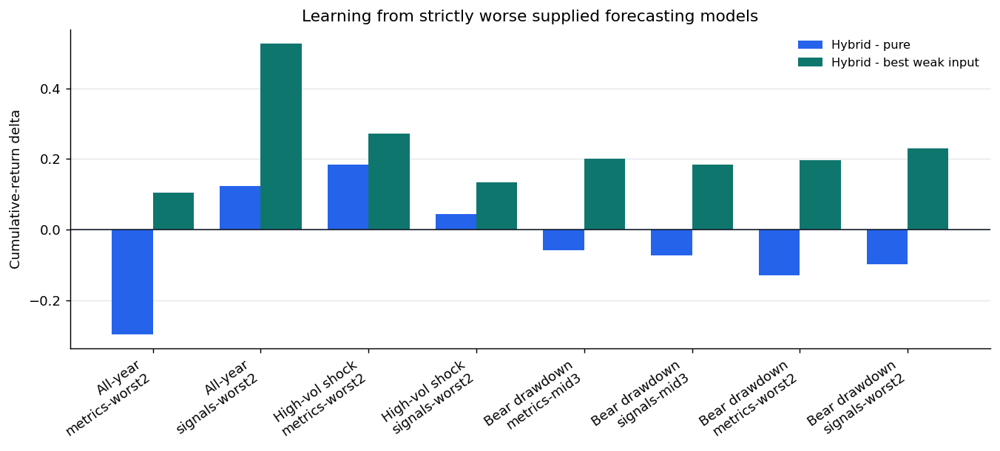
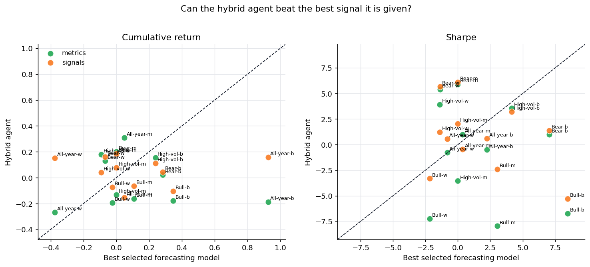

# Agent Forecast-Signal Learning Analysis

This analysis tests whether feeding forecasting-model information to the LLM trading agent improves stability, how performance changes across `best2`/`mid3`/`worst2` model tiers, and whether the agent improves on weak supplied signals rather than merely copying strong model outputs. It uses only existing artifacts under `TradingAgents/outputs`; no new agent runs or backtests were performed.

## Data and Definitions

- Evaluation windows: all-year 2025, high-volatility shock, bull breakout, and bear drawdown.
- Hybrid modes: `metrics` exposes model performance/statistical summaries; `signals` exposes directional model outputs.
- Model tiers are window-specific and loaded from each `selected_models.json`.
- A forecasting model is **better than pure** only if both cumulative return and Sharpe exceed the pure agent. It is **worse than pure** only if both are lower. Mixed cases are not used for strong weak-signal learning claims.
- For "beats the best supplied signal", the hybrid must exceed the best selected forecasting-model cumulative return and the best selected forecasting-model Sharpe. These best values may come from different selected models, making the criterion intentionally strict.

## 1. Does Forecasting-Model Input Stabilize the Agent?

| Method | Avg ann. vol | Avg downside vol | Avg abs max drawdown | Avg abs CVaR 95 | Cum-return std across windows | Sharpe std across windows |
| --- | ---: | ---: | ---: | ---: | ---: | ---: |
| Pure | 41.5% | 25.1% | 14.9% | 1.0% | 12.8% | 3.91 |
| Hybrid metrics | 37.2% | 24.6% | 18.7% | 1.0% | 18.1% | 4.62 |
| Hybrid signals | 36.2% | 22.7% | 14.8% | 0.9% | 10.8% | 3.18 |

**Finding.** Forecasting-model input improves some within-run risk measures but does not uniformly stabilize the agent. The `signals` hybrids have the lowest average annualized volatility and downside volatility, while the pure agent has lower average absolute maximum drawdown than the average hybrid configuration. Across-window variance is also mixed: hybrid configurations can reduce or increase regime sensitivity depending on the tier and input mode.

## 2. How Do `best2`, `mid3`, and `worst2` Forecast Inputs Change Agent Performance?

| Mode | Tier | Mean cum. return | Cum-return std | Mean Sharpe | Strict beats pure | Strict beats best input |
| --- | --- | ---: | ---: | ---: | ---: | ---: |
| metrics | best2 | -4.7% | 16.6% | -0.67 | 1/4 | 0/4 |
| metrics | mid3 | 5.3% | 23.6% | -1.15 | 1/4 | 2/4 |
| metrics | worst2 | -3.8% | 22.6% | 0.33 | 1/4 | 3/4 |
| signals | best2 | 5.2% | 11.4% | -0.01 | 2/4 | 0/4 |
| signals | mid3 | 1.1% | 15.0% | 1.32 | 2/4 | 2/4 |
| signals | worst2 | 7.0% | 11.0% | 1.04 | 3/4 | 3/4 |

**Finding.** Tier quality is not monotonic. The highest-return hybrid configuration is `metrics-mid3` in `All-year` with 30.8% cumulative return, while the highest-Sharpe hybrid configuration is `signals-mid3` in `Bear drawdown` with Sharpe 6.10. This supports the claim that the model subset and representation format matter; the agent is not simply better whenever the tier is labeled better.

## 3. Does the Agent Learn from Forecasting Models That Are Worse Than the Pure Agent?

The strict return-and-Sharpe rule identifies 8 hybrid cases where every selected forecasting model is worse than the pure agent. In these cases, the hybrid beats the pure agent in 3/8 cases and beats the best weak supplied model in 8/8 cases.

| Window | Tier | Mode | Selected weak models | Hybrid - pure return | Hybrid - best weak return | Hybrid - pure Sharpe | Hybrid - best weak Sharpe |
| --- | --- | --- | --- | ---: | ---: | ---: | ---: |
| All-year | worst2 | metrics | macd, sma_cross | -29.7% | 10.5% | -1.01 | 0.06 |
| All-year | worst2 | signals | macd, sma_cross | 12.4% | 52.6% | 0.33 | 1.39 |
| Bear drawdown | mid3 | metrics | arima_garch, xgboost, xgb_lstm_ensemble | -5.9% | 20.0% | -1.16 | 5.91 |
| Bear drawdown | mid3 | signals | arima_garch, xgboost, xgb_lstm_ensemble | -7.4% | 18.5% | -0.97 | 6.10 |
| Bear drawdown | worst2 | metrics | macd, buy_and_hold | -12.9% | 19.7% | -1.68 | 6.76 |
| Bear drawdown | worst2 | signals | macd, buy_and_hold | -9.8% | 22.9% | -1.38 | 7.05 |
| High-vol shock | worst2 | metrics | buy_and_hold, sma_cross | 18.3% | 27.2% | 3.67 | 5.30 |
| High-vol shock | worst2 | signals | buy_and_hold, sma_cross | 4.4% | 13.4% | 0.96 | 2.59 |

**Finding.** The weak-signal cases provide evidence that the hybrid agent is not merely copying the supplied forecasting signals: it beats the best weak supplied model in all 8/8 strict weak-input cases. However, weak inputs do not reliably improve the agent relative to its pure version, since the hybrid beats pure in only 3/8 cases. The strongest interpretation is therefore selective learning/arbitration from weak models, not a guarantee that weak model evidence stabilizes or improves the agent.

## 4. Can the Agent Beat the Best Signal It Is Given?

Across all 24 window-tier-mode cases, the hybrid agent strictly beats the best selected forecasting input in 10/24 cases and strictly beats the pure agent in 10/24 cases.

| Window | Tier | Mode | Selected models | Hybrid return | Best input return | Hybrid Sharpe | Best input Sharpe |
| --- | --- | --- | --- | ---: | ---: | ---: | ---: |
| All-year | mid3 | metrics | arima_garch, buy_and_hold, xgb_lstm_ensemble | 30.8% | 4.9% | 0.99 | 0.37 |
| All-year | worst2 | metrics | macd, sma_cross | -26.9% | -37.4% | -0.75 | -0.81 |
| All-year | worst2 | signals | macd, sma_cross | 15.1% | -37.4% | 0.58 | -0.81 |
| Bear drawdown | mid3 | metrics | arima_garch, xgboost, xgb_lstm_ensemble | 20.0% | 0.0% | 5.91 | 0.00 |
| Bear drawdown | mid3 | signals | arima_garch, xgboost, xgb_lstm_ensemble | 18.5% | 0.0% | 6.10 | 0.00 |
| Bear drawdown | worst2 | metrics | macd, buy_and_hold | 12.9% | -6.8% | 5.39 | -1.37 |
| Bear drawdown | worst2 | signals | macd, buy_and_hold | 16.1% | -6.8% | 5.69 | -1.37 |
| High-vol shock | mid3 | signals | arima_garch, lstm, xgboost | 7.8% | 0.0% | 2.03 | 0.00 |
| High-vol shock | worst2 | metrics | buy_and_hold, sma_cross | 18.0% | -9.2% | 3.92 | -1.38 |
| High-vol shock | worst2 | signals | buy_and_hold, sma_cross | 4.2% | -9.2% | 1.22 | -1.38 |

**Finding.** The agent can sometimes beat the best supplied signal set, but it is not the dominant pattern. Points above the diagonal in either scatter panel show metric-level improvement; the strict two-metric count is smaller because a case must beat the best selected return and the best selected Sharpe simultaneously.

## Caveats

- The three regime windows are only 30 calendar days. Annualized Sharpe, annualized return, and Calmar can be inflated on short windows, so cumulative return, drawdown, and cross-window consistency should carry more interpretive weight.
- The all-year signals-mode runs have leakage-audit failures in the existing metadata. Signals-mode all-year conclusions should therefore be presented as suggestive until those failures are resolved.
- The strict better/worse rule intentionally reduces the number of eligible weak-signal cases. This makes the non-trivial learning claim more conservative but less sample-efficient.
- `best2`, `mid3`, and `worst2` are selected separately per window, so the labels are local to each regime rather than a single global ordering of models.

## Reproducibility Artifacts

- Tidy computed table: `Report/agent_forecast_signal_analysis_table.csv`
- Figures directory: `Report/figures/agent_forecast_signal_analysis`
- Source comparisons: `TradingAgents/outputs/*/*_final_comparison/tiers/*/comparison_pure_hybrid_traditional.json`
- Source tier definitions: `TradingAgents/outputs/*/*_final_comparison/tiers/*/selected_models.json`
