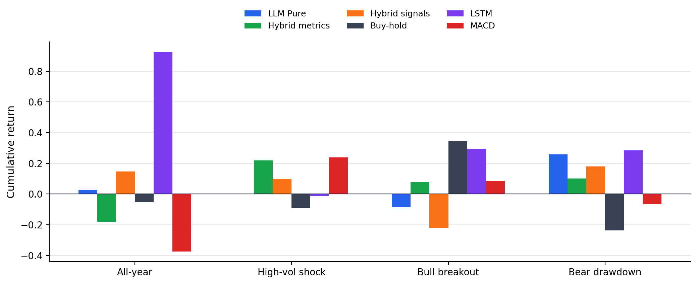
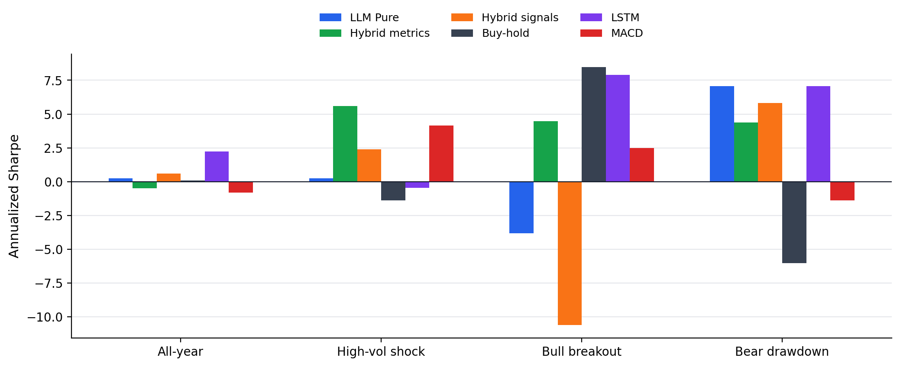

# Results

We evaluate pure LLM agents, hybrid model-agent systems, and non-agent forecasting baselines on matched BTC calendars. The agent systems emit one daily decision, which is forward-filled to the hourly backtesting grid used by the forecasting baselines. This alignment makes the comparison stricter than reporting each method on its own preferred calendar: every strategy in a given table is evaluated over the same market bars and benchmark path.

The completed artifacts cover four evaluation windows: the full 2025 calendar year, a high-volatility shock window from 2025-02-24 to 2025-03-25, a bull breakout window from 2025-04-09 to 2025-05-08, and a bear drawdown window from 2025-10-27 to 2025-11-25. The LLM runs use the `market`, `news`, and `fundamentals` analysts with `qwen3:8b` for fast reasoning and `qwen3:30b-a3b` for deeper reasoning. All reported runs completed with zero execution errors. The metrics-mode hybrid runs had zero failed leakage checks; the all-year signals-mode run had 7 failed checks out of 2555 audit checks, so signals-mode all-year conclusions should be interpreted with that caveat.

## Full-Year Results

Full-year 2025 BTC results on the same signal calendar. Returns and drawdowns are reported as percentages.

| Strategy | Cum. Return | Sharpe | Max Drawdown | Excess vs. B&H |
| --- | ---: | ---: | ---: | ---: |
| Buy and hold | -5.4 | 0.10 | -34.8 | 0.0 |
| LSTM | 92.6 | 2.24 | -18.7 | 98.0 |
| XGBoost | 4.9 | 0.39 | -9.3 | 10.4 |
| XGB-LSTM ensemble | 4.9 | 0.37 | -13.0 | 10.4 |
| LLM Pure | 2.8 | 0.26 | -24.9 | 8.2 |
| LLM Hybrid (signals) | 14.7 | 0.60 | -24.0 | 20.2 |
| LLM Hybrid (metrics) | -18.0 | -0.48 | -40.0 | -12.5 |
| Best hybrid ablation: metrics mid3 | 30.8 | 0.99 | -26.3 | 36.2 |
| Best hybrid ablation: signals best2 | 15.9 | 0.62 | -20.0 | 21.3 |

On the full-year benchmark, the strongest standalone method is the LSTM baseline, which obtains a 92.6% cumulative return and a Sharpe ratio of 2.24 while reducing maximum drawdown relative to buy-and-hold. The pure LLM agent beats buy-and-hold in absolute and excess return, but only modestly: it returns 2.8% with Sharpe 0.26. The default signals-mode hybrid improves over the pure agent, reaching 14.7% cumulative return and Sharpe 0.60, while the default metrics-mode hybrid underperforms. The best all-year hybrid ablation is the metrics mid3 configuration, which exposes `arima_garch`, `buy_and_hold`, and `xgb_lstm_ensemble` summaries to the agent; it reaches 30.8% cumulative return and Sharpe 0.99. Thus, hybridization helps only when the information interface and model subset are well matched.

*Cumulative return across the full-year and regime-specific windows for the principal method families.*

*Annualized Sharpe ratio across the full-year and regime-specific windows. Annualized values on 30-day windows should be read as directional risk-adjusted summaries rather than long-horizon performance estimates.*

## Regime Results

Regime-specific cumulative returns and Sharpe ratios for representative strategies.

| Window | Strategy | Cum. Return | Sharpe |
| --- | --- | ---: | ---: |
| High-volatility shock | Buy and hold | -9.2 | -1.38 |
| High-volatility shock | MACD | 23.8 | 4.15 |
| High-volatility shock | LLM Pure | -0.2 | 0.26 |
| High-volatility shock | LLM Hybrid (metrics) | 21.8 | 5.59 |
| High-volatility shock | LLM Hybrid (signals) | 9.7 | 2.41 |
| Bull breakout | Buy and hold | 34.6 | 8.47 |
| Bull breakout | LSTM | 29.6 | 7.88 |
| Bull breakout | LLM Pure | -8.7 | -3.82 |
| Bull breakout | LLM Hybrid (metrics) | 7.7 | 4.47 |
| Bull breakout | LLM Hybrid (signals) | -22.0 | -10.59 |
| Bear drawdown | Buy and hold | -23.6 | -6.02 |
| Bear drawdown | LSTM | 28.4 | 7.06 |
| Bear drawdown | LLM Pure | 25.9 | 7.07 |
| Bear drawdown | LLM Hybrid (metrics) | 10.1 | 4.38 |
| Bear drawdown | LLM Hybrid (signals) | 18.0 | 5.81 |

# Analysis

The main empirical result is not that LLM agents uniformly dominate quantitative models. They do not. Instead, the results show a sharper and more useful pattern: LLM agents are strongest when the market regime rewards cautious, asymmetric exposure, while conventional forecasting models are strongest when the dominant signal is already captured by price dynamics.

The bull breakout window is the clearest failure case for the agentic systems. Buy-and-hold returns 34.6% and LSTM returns 29.6%, while the pure LLM agent loses 8.7%. This suggests that the current pure-agent prompt stack is too conservative in fast upward trends. The agent appears to treat large prior moves and volatility as reasons for risk reduction rather than as evidence of persistent momentum. The metrics-mode hybrid partially corrects this behavior and reaches a positive 7.7% return, but it still leaves most of the trend premium uncaptured.

The bear drawdown window shows the opposite behavior. Buy-and-hold loses 23.6%, while the pure LLM agent gains 25.9% with a Sharpe ratio of 7.07. This is the best regime for the pure agent and indicates that its qualitative risk reasoning is useful when avoiding or shorting the market is more important than maintaining trend exposure. Signals-mode hybridization also performs well in this regime, returning 18.0% with Sharpe 5.81. However, it does not surpass the pure agent, which implies that model signals can dilute an already effective risk-off decision process.

In the high-volatility shock window, the default metrics-mode hybrid is the most attractive agentic method: it returns 21.8% with Sharpe 5.59, close to the MACD return of 23.8% but with higher risk-adjusted performance. This result supports the central hypothesis of the project. Structured model diagnostics can help agents when the environment is unstable and purely qualitative reasoning is not sufficient. At the same time, the ablations show that the benefit is fragile: metrics mid3 is negative in this window, while metrics best2 and worst2 are positive. The agent is therefore sensitive not only to whether quantitative information is provided, but also to which quantitative models are exposed.

The full-year results aggregate these regime effects. The LSTM baseline remains the strongest method overall, largely because it captures large directional moves that the agents often under-trade. Nevertheless, hybrid systems improve over the pure agent in the full-year setting when the interface is chosen well. The metrics mid3 ablation improves cumulative return from 2.8% for the pure agent to 30.8%, and the signals best2 ablation improves maximum drawdown from -24.9% to -20.0%. These gains suggest that hybrid agents can add value, but they are not plug-and-play: the model subset, information representation, and regime all matter.

# Discussion

These experiments support a nuanced answer to the project's motivating question. Raw-evidence LLM reasoning is not enough to beat strong quantitative baselines across a full trading year. The pure agent is useful as a risk-aware decision maker, especially in bearish conditions, but it sacrifices too much upside in persistent bull trends. Conversely, pure forecasting models can exploit price-driven regimes effectively, but their performance varies sharply across windows and can fail when the selected model is mismatched to the regime.

The hybrid approach is most promising when it treats quantitative models as structured evidence rather than as commands. Metrics-mode inputs appear valuable during volatile or mixed regimes because they expose reliability and risk information that the agent can reason over. Signals-mode inputs can improve full-year performance and bear-market behavior, but they also create two risks: the agent may overreact to directional recommendations, and the signal construction pipeline must be carefully audited for leakage. The small number of all-year signals-mode leakage audit failures should be resolved before making a strong claim about that configuration.

Several limitations remain. First, the 30-day regime windows are intentionally diagnostic rather than statistically definitive; annualized return, Calmar, and Sharpe can be inflated on such short horizons. Cumulative return, maximum drawdown, and qualitative regime consistency should therefore receive more weight for these windows. Second, the LLM experiments use one daily decision path per configuration. A NeurIPS-quality evaluation should add repeated runs, prompt/model seed variation, block bootstrap confidence intervals, and transaction-cost sensitivity. Third, the current agent interface is still coarse: it maps rich reasoning into a tri-state position and then forward-fills it. Future work should test continuous position sizing, explicit uncertainty calibration, and a risk manager that can condition position size on both model confidence and recent drawdown.

Overall, the evidence favors a modular design. Forecasting models should remain responsible for extracting price-based statistical structure, while agents should be used for regime interpretation, risk control, and arbitration among conflicting signals. The best current system is not the pure agent and not the default hybrid; it is a carefully selected hybrid interface whose advantage appears only after controlling the calendar, benchmark, and information exposure. This is the key result for the final paper: agentic trading systems should be evaluated not by whether they replace quantitative models, but by whether they improve the decision layer under matched, leakage-controlled backtests.
