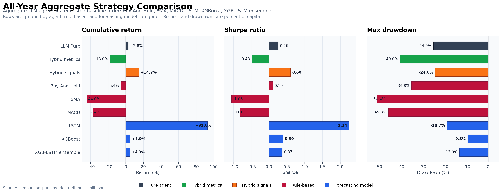

# Aggregate Comparison: Pure, Hybrid, and Traditional Strategies

**Evaluation window:** 365 calendar days, 2025-01-01 to 2025-12-31.

Forecast baselines are evaluated on the same hourly bars as the agent runs. Returns, drawdowns, excess return, and hit rate are shown as percentages. Higher is better except for max drawdown, where values closer to zero indicate smaller peak-to-trough losses.

---

## Headline Readout

| Readout | Result |
| --- | ---: |
| Best aggregate LLM input mode | **LLM Hybrid (signals): +14.7%, Sharpe 0.60** |
| Best non-agent return | **LSTM: +92.6%, Sharpe 2.24** |
| Best non-agent drawdown | **XGBoost: -9.3% max drawdown** |
| Buy-And-Hold rule-based reference | **-5.4%, Sharpe 0.10** |

## Agent Strategies

| Strategy | Input set | Cum. return | Ann. return | Sharpe | Sortino | Max DD | Calmar | Excess vs B&H | Info ratio | Hit rate | Profit factor |
| --- | --- | ---: | ---: | ---: | ---: | ---: | ---: | ---: | ---: | ---: | ---: |
| LLM Pure | None | +2.8% | +2.8% | 0.26 | 0.40 | -24.9% | 0.11 | +8.2% | 0.06 | 49.5% | 1.01 |
| LLM Hybrid (metrics) | All models | -18.0% | -18.0% | -0.48 | -0.73 | -40.0% | -0.45 | -12.5% | -0.28 | 49.6% | 0.98 |
| LLM Hybrid (signals) | All models | +14.7% | +14.8% | 0.60 | 0.95 | -24.0% | 0.62 | +20.2% | 0.20 | **50.5%** | 1.03 |

## Rule-Based and Forecasting Baselines

| Strategy | Group | Cum. return | Ann. return | Sharpe | Sortino | Max DD | Calmar | Excess vs B&H | Info ratio | Hit rate | Profit factor |
| --- | --- | ---: | ---: | ---: | ---: | ---: | ---: | ---: | ---: | ---: | ---: |
| Buy-And-Hold | Rule-based | -5.4% | -5.5% | 0.10 | 0.16 | -34.8% | -0.16 | +0.0% | 0.00 | **50.6%** | 1.00 |
| SMA | Rule-based | -44.0% | -44.1% | -1.06 | -1.63 | -50.4% | -0.88 | -38.6% | -0.78 | 49.9% | 0.97 |
| MACD | Rule-based | -37.4% | -37.5% | -0.81 | -1.33 | -45.3% | -0.83 | -32.0% | -0.63 | 48.8% | 0.97 |
| LSTM | Forecasting model | **+92.6%** | **+93.0%** | **2.24** | **3.57** | -18.7% | **4.97** | **+98.0%** | **1.30** | 50.5% | **1.10** |
| XGBoost | Forecasting model | +4.9% | +4.9% | 0.39 | 0.56 | **-9.3%** | 0.53 | +10.4% | 0.03 | 50.2% | 1.04 |
| XGB-LSTM ensemble | Forecasting model | +4.9% | +4.9% | 0.37 | 0.54 | -13.0% | 0.38 | +10.4% | 0.03 | 50.0% | 1.03 |

## Source Files

- `comparison_pure_hybrid_traditional_split.json`
